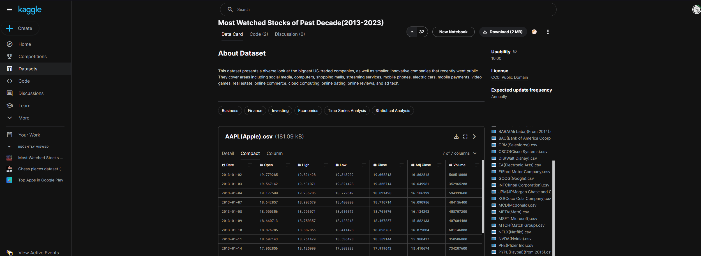

# Group 35 - Stock Market Analysis of the biggest US companies (2013-2023)

## Milestones

Details for Milestone are available on Canvas (left sidebar, Course Project).

## Describe your topic/interest in about 150-200 words

Investing in stocks has never been an easy or foolproof way to earn money. This analysis involves a massive dataset of the top 30 US companies, and while no prediction can be 100% accurate, it will enable viewers to make informed decisions and maximize the chance of profits. We have agreed on the idea of stock market because of the current economic situation of several countries on earth. Trade and profits are steadily declining across the globe due to the effect of the aftermath of Covid-19. Several major companies are laying off a large portion of their employees as well to minimize expenses. Stock market investors need to make wise moves on which stocks to sell and which to hold onto for later. Our analysis will help them in these tough times.

## Describe your dataset in about 150-200 words

The dataset we have chosen was obtained from the popular website Kaggle which has multiple datasets of varying lengths from a large variety of topics. This dataset has data on the stock prices of the top 30 US companies from 2013 to 2023. The author has licensed this dataset through **public domain**, which enables everyone to freely use this data without being involved in legal problems. We believe that this dataset has the best data for an accurate analysis because the past decade has seen the greatest fluctuations in the stock market due to the rising number of tech giants and demand for e-commerce. The companies in this dataset have seen their stock prices increasing by several times, hence having a vast amount of data that can be used for analysis.

## Team Members

- Shakthi Vel: Hello, I'm interested in programming and I like chess.
- Saketh Anand: I work in Tim Hortons and am honing my skills in programming.
- Person 3: one sentence about you!

## Images

{You should use this area to add a screenshot of an interesting plot, or of your dashboard}

## References

[Past decade dataset](https://www.kaggle.com/datasets/kane6543/most-watched-stocks-of-past-decade20132023?select=AAPL%28Apple%29.csv)

[Second reference link - linear regression](https://www.kaggle.com/code/kane6543/stock-prediction-linear-regression-moving-avg)

