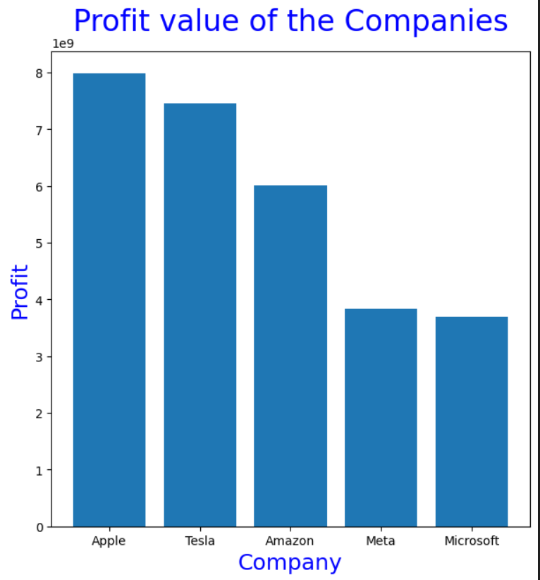
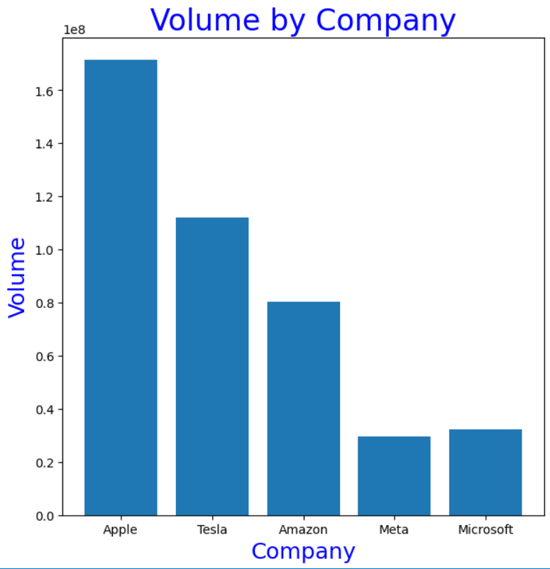

### Analysis 2 summary (Saketh)
Question - How proper analysis of the data can help in making informed decisions on which company to invest in stocks

I had come with an idea to do excatly that, how I did this was calculating the profit value of all the companies and conpare them and see which has the biggest profit returns. Knowing this, we can invest there to reduce the risk of any loss.
I had calculated the profit of each company by - Profit = Volume per Company * Closing value per Company
We can see exactly that over here:

Along with this I had also realised that analysing the volume of shares sold per company can also be informative as that shows how succesful the companies are so I had made a graph to excatly show that:

With that it is easy to conclude that Apple, Amazon and Tesla are the best to invest in among the 30 companies as they have the highest volume of shares sold as well as the highest returns of profit.
I personally would split my investments among these 3 companies so that it would thrive and maximise my returns and prevent any loss.

[Further analysis can be seen in my analysis notebook over here including code and the data](../analysis/analysis2.ipynb)
