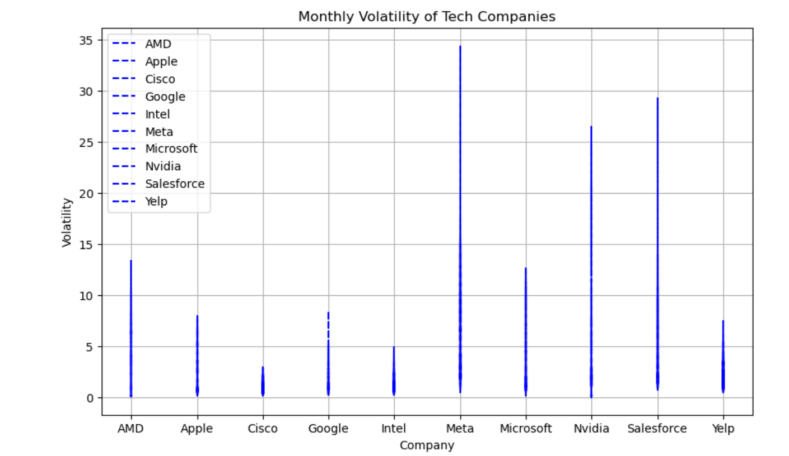

# Introduction 

There are many important things that is required to know before investing in stocks, this is informed in detail in the final report of the project. 

To start, Saketh was interested in how the visializations and analysis of datasets can be used to smartly invest in stocks without any risk of loss and more probability to maximize the returns and profits. This is a very important and useful information to always know as it primarily saves our money, especially during the infaltion and all the taxes. Suppose upon analysing 7 companies interested to invest in, there are 3 companies that show maximum return and success, then instead of fully investing in 1 place, it can be split and invested in 3 places so that it further reduces the risk of any loss.  
Likewise, Vanshika was interested to explore more about the Exchange Traded Funds  Models as they are an important investment option due to their low-cost diversification, high liquidity, transparency, and flexibility in investment strategies. Further, they offer investors an efficient way to gain diversified exposure to a wide range of asset classes, while also being able to trade quickly and efficiently throughout the day, it adds more value in our project. The transparency of ETFs allows investors to make informed decisions about which ETFs to invest in and monitor their performance over time. ETFs also offer flexibility in terms of investment strategies, allowing investors to tailor their portfolios to their specific investment goals and risk tolerance. As such, ETFs have become an increasingly popular investment option for both individual and institutional investors. Due to these important factors, she analysis the data of all the tech industries and make the ETF baskets for the Yearly and Monthly basis.

### Analysis 1 (Vanshika)

### Which Technology based industries are secure to be included in an Yearly and a Monthly EFT model?

Initially, I observed that there are significantly more tech companies in the data frame than companies from other fields, which may skew the results. Despite this minority, I recognize that tech companies have a positive return on investment, 
so I will focus exclusively on the tech industry to ensure more accurate results. This ETF will provide investors with positive returns and fewer fluctuations. 
### Monthly ETF

Clearly, AMD, SALESFORCE , Nvidia and Yelp are not profitable so we can skip these companyies for our Monthly EFT Basket.

Let's take a look at the  standard deviation of the close value of these stocks as the measure of the volatility of the asset's returns over the chosen time period. The higher the standard deviation, the greater the volatility

Meta, Nvidia and Salesforce are showing the most Volatility on monthly basis. 

CONCLUSION FOR MONTHLY EFT BASKET-

After looking at all the graphs and relationS. The favourable companies that are more profitable and less Volatile will be

- Microsoft
- Intel
- Google
- Apple
- Cisco

### For the Yearly ETF

We observe that certain companies show considerably high volatility in their stock prices. Specifically, AMD, Nvidia, and Yelp have been identified as highly volatile companies that may not be suitable for the EFT if their profits are not good enough.

On the other hand, companies like 

- Microsoft
- Meta
- Intel
- Google
- Cisco
- Apple

have shown positive values in their profit and are less volatile. Therefore, based on our analysis, we can conclude that these companies would be suitable for our yearly Bucket.

