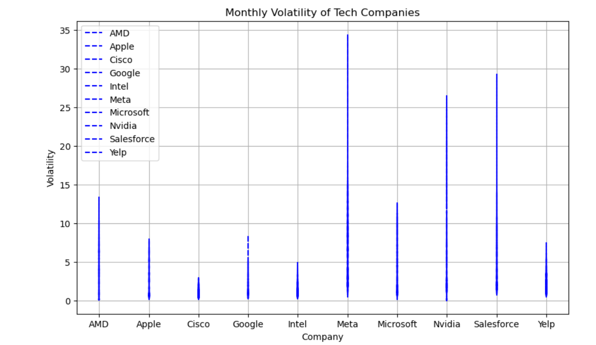

(Analysis 1) Vanshika 

Question 
Which Technology based industries are secure to be included in an Yearly and a Monthly EFT model?

Initially, I observed that there are significantly more tech companies in the data frame than companies from other fields, which may skew the results. Despite this minority, I recognize that tech companies have a positive return on investment, 
so I will focus exclusively on the tech industry to ensure more accurate results. This ETF will provide investors with positive returns and fewer fluctuations. 

Clearly, AMD, SALESFORCE , Nvidia and Yelp are not profitable so we can skip these companyies for our Monthly EFT Basket.

Let's take a look at the  standard deviation of the close value of these stocks as the measure of the volatility of the asset's returns over the chosen time period. The higher the standard deviation, the greater the volatility

Meta, Nvidia and Salesforce are showing the most Volatility on monthly basis. 

##### For the Yearly EFT

We observe that certain companies show considerably high volatility in their stock prices. Specifically, AMD, Nvidia, and Yelp have been identified as highly volatile companies that may not be suitable for the EFT if their profits are not good enough.

On the other hand, companies like

Microsoft
Meta
Intel
Google
Cisco
Apple
have shown positive values in their profit and are less volatile. Therefore, based on our analysis, we can conclude that these companies would be suitable for our yearly Bucket.

